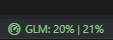
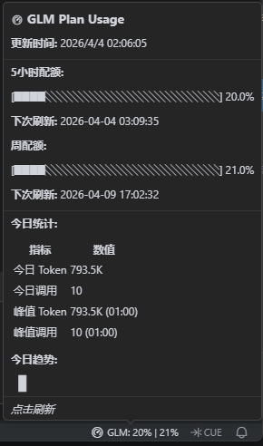
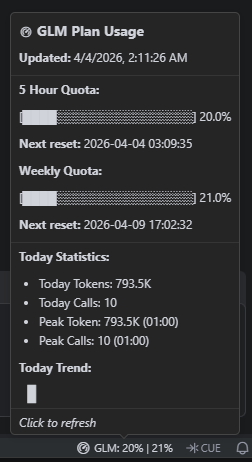

# GLM Plan Usage

[English Intro](#english)

---

状态栏中实时监控 GLM Coding Plan 的配额使用情况。支持 **bigmodel.cn** 和 **Z.ai** 平台。

### 功能特性

- **状态栏监控**：实时显示 5 小时和周配额使用百分比，颜色随使用率变化
  - 🟢 绿色：< 70%
  - 🟡 黄色：70% ~ 89%
  - 🔴 红色：≥ 90%
- **富文本提示**：鼠标悬停显示详细配额信息和今日使用趋势图
- **今日统计**：显示今日 Token 用量、调用次数、峰值数据
- **趋势图表**：Unicode 柱状图展示今日每小时使用趋势
- **配额预警**：使用率达到 90% 时自动弹出警告通知
- **自动刷新**：可配置定时自动刷新配额数据
- **多平台支持**：支持 智谱(cn) 和 Z.ai 平台
- **国际化**：支持中文和英文界面

### 截图

#### 状态栏

状态栏右侧显示合并指标：`5h: XX.X% | Week: XX.X%`

#### 悬停显示

悬停提示包含：
- 更新时间
- 5 小时配额进度条及下次刷新时间
- 周配额进度条及下次刷新时间
- 今日统计：今日 Token、今日调用、峰值 Token、峰值调用
- 今日趋势：Unicode 柱状图展示每小时使用情况

### 配置

在设置中配置（`Ctrl+,`）：

| 设置项 | 说明 | 默认值 |
|--------|------|--------|
| `glmPlanUsage.authToken` | API Key，也可通过环境变量 `GLM_API_KEY` 配置 | - |
| `glmPlanUsage.baseUrl` | API 地址，下拉选择 | `https://open.bigmodel.cn/api/anthropic` |
| `glmPlanUsage.autoRefresh` | 启动时自动刷新 | `true` |
| `glmPlanUsage.refreshInterval` | 自动刷新间隔（秒），`0` 为禁用 | `300` |

#### 支持的 API 地址

| 平台 | 地址 |
|------|------|
| ZHIPU（智谱） | `https://open.bigmodel.cn/api/anthropic` |
| ZHIPU 开发环境 | `https://dev.bigmodel.cn/api/anthropic` |
| Z.ai | `https://api.z.ai/api/anthropic` |

#### 获取 API Key

- **ZHIPU 平台**：登录 [open.bigmodel.cn](https://open.bigmodel.cn)，在 API Keys 页面获取
- **Z.ai 平台**：登录 [z.ai](https://z.ai)，在账户设置中获取

### 使用方法

1. 配置 API Key 和 Base URL
2. 打开命令面板（`Ctrl+Shift+P`），输入 `GLM Plan Usage: Query Usage Statistics`
3. 或直接点击状态栏中的配额指标

扩展会在启动时自动查询并定时刷新。

---

## Introduction

Real-time monitoring of GLM Coding Plan quota usage in the status bar. Supports **bigmodel.cn** and **Z.ai** platforms.

### Features

- **Status Bar Monitoring**: Real-time display of 5-hour and weekly quota usage percentages with color-coded indicators
  - 🟢 Green: < 70%
  - 🟡 Yellow: 70% ~ 89%
  - 🔴 Red: ≥ 90%
- **Rich Tooltip**: Hover to view detailed quota information and today's usage trend chart
- **Today Statistics**: Display today's token usage, call count, and peak data
- **Trend Chart**: Unicode bar chart showing hourly usage trend for today
- **Quota Warning**: Automatic warning notification when usage reaches 90%
- **Auto Refresh**: Configurable automatic quota data refresh
- **Multi-Platform Support**: Supports ZHIPU (cn) and Z.ai platforms
- **Internationalization**: Supports Chinese and English interface

### Screenshots

#### Status Bar

Combined indicator displayed on the right side of the status bar: `5h: XX.X% | Week: XX.X%`

#### Tooltip

The tooltip includes:
- Updated time
- 5-hour quota progress bar with next reset time
- Weekly quota progress bar with next reset time
- Today Statistics: Today Tokens, Today Calls, Peak Token, Peak Calls
- Today Trend: Unicode bar chart showing hourly usage

### Configuration

Configure in settings (`Ctrl+,`):

| Setting | Description | Default |
|--------|------|--------|
| `glmPlanUsage.authToken` | API Key, can also be configured via environment variable `GLM_API_KEY` | - |
| `glmPlanUsage.baseUrl` | API URL, select from dropdown | `https://open.bigmodel.cn/api/anthropic` |
| `glmPlanUsage.autoRefresh` | Auto refresh on startup | `true` |
| `glmPlanUsage.refreshInterval` | Auto refresh interval (seconds), `0` to disable | `300` |

#### Supported API URLs

| Platform | URL |
|------|------|
| ZHIPU | `https://open.bigmodel.cn/api/anthropic` |
| ZHIPU Dev | `https://dev.bigmodel.cn/api/anthropic` |
| Z.ai | `https://api.z.ai/api/anthropic` |

#### Get API Key

- **ZHIPU Platform**: Login to [open.bigmodel.cn](https://open.bigmodel.cn), get it from the API Keys page
- **Z.ai Platform**: Login to [z.ai](https://z.ai), get it from account settings

### Usage

1. Configure API Key and Base URL
2. Open command palette (`Ctrl+Shift+P`), type `GLM Plan Usage: Query Usage Statistics`
3. Or click the quota indicator in the status bar directly

The extension will automatically query on startup and refresh periodically.
